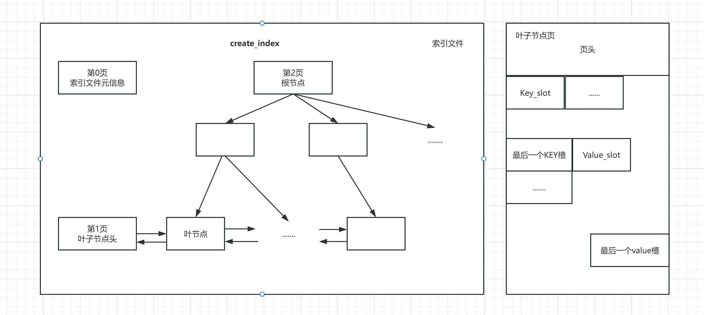

index模块负责进行索引文件的维护
# 页结构
 
 页头、索引文件元信息（文件头）定义在ix_defs;

 # 索引管理类(ix_manager)
 ## 新建索引(create_index)
 该函数申请并初始化了三个页面。每个节点独占一整个页面。并把三个页面刷入磁盘中
 - 0号页面是索引文件的元信息页面（也叫索引文件头）
 - 1号页面是叶子节点头页面
 - 2号页面是B+树的根节点页面
## 删除索引（destroy_index）
该函数调用disk_manager的删除文件操作，将删除整个索引文件
## 打开索引(open_index)
该函数通过索引文件标识符，调用disk_manager把索引读入内存，然后返回一个索引操作对象`IxIndexHandler`
底层通过调用disk_manager去读取文件（未实现）

# 索引文件操作类
操作整个索引文件、包括B+树的构建、节点增、删、合并、分裂。大多的方法都没实现（悲）
# 索引节点操作类
对一个节点页面进行操作、插入、删除某个KEY。还应该提供遍历每个节点内的slot的方法。

`lower_bound`与`upper_bound`用于遍历页内的key。

`leaf_lookup`用来定位某个key对应的RID。`internal_lookup`用来在非叶子节点定位某个key的下一个节点。

`insert`、`remove`、`erase` 顾名思义

`split`节点分裂（B+树核心操作）。创建新节点（右兄弟节点）,原节点和新节点 各自拿一半键值对。维护叶子节点的链表指针（prev_leaf / next_leaf）,更新内部节点指向新节点。

重点注意：
- 叶子节点分裂 → 更新左右兄弟指针链表。
- 内部节点分裂 → 更新子节点的父节点指针。
- unpin 处理旧节点和新节点，防止内存泄漏。