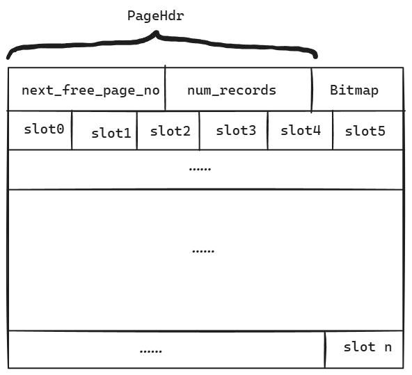

记录模块主要管理记录的定义、存储格式，以及一些必要的数据结构。
# Bitmap
Bitmap的所有方法均为静态，本身并不保存任何状态，仅仅提供bitmap的操作函数。目前在record的page中有使用。

定义的public方法有：init, set, reset, is_set, next_bit 和 first_bit，详细作用见注释。该类提供了bitmap初始化、位查询和位写入的功能。Bitmap的所有方法均已实现。

# RmRecord
RmRecord定义了表中的记录，其内容包含记录的数据data、记录的大小size、是否为数据分配空间allocated_。定义了若干构造函数并提供写入data、反序列化的功能。这些功能均已实现。RmRecord本身并不掌握记录具体的格式，它仅仅以字节串的形式存储记录内容。

# RmFileHdr和RmPageHdr
这两个类分别定义了表文件的文件头和页头，分别存储在每个表文件的第一个页首部和后续的页首部。

RmFileHdr记录表数据文件的元信息，包含记录的大小、分配的页面个数、每个页面最多存储的元组个数、第一个空闲的页面号、每个页面的bitmap大小等。RmPageHdr存储除当前页面之外，下一个空闲空间的页面号，以及当前页面存储的记录个数。这样组织页头和文件头就可以快速定位到空闲的page，进而通过bitmap找到空闲的slot。

需要注意的是目前的定义仅支持定长记录，如果要在该基础上直接扩展，可以定义新的变长数据页，并将变长字段改为变长数据页中变长数据的引用。

# RmPageHandle
RmPageHandle是管理数据页的结构，它保存了file_hdr、page、page_hdr、bitmap、slots等内容。其中，file_hdr是文件头的指针，page是页面的指针，page_hdr、bitmap、slots都是page->data中定义的内容，其组织格式为：page_hdr在第一部分，bitmap在第二部分用来存储页面bitmap的首地址，slots在第三部分用来存储记录开始的首地址。页面bitmap的每一位一一映射到每一个slot是否有记录这一状态。

get_slot方法可以返回指定slot的首地址。

**需要注意RmPageHandle的生命周期。当成员page正在使用的时候，它的状态是pinned，因此不会被换出，如果有一瞬间不再使用这个page了，那么就需要unpin该page，此后便不能够保证page不被换出。在unpin之后的每一个时刻page都有可能无效，因此unpin之后，也就是RmPageHandle使用完成后，其生命周期就结束了。即使此后再使用同一个对象，也不能保证有效性。**

# RmFileHandle
RmFileHandle是对整个数据文件的管理结构。它保存了disk_manager_、buffer_pool_manager_、fd_、file_hdr_，并提供了record的增删改查方法，以及创建和获取page handle的方法。

file_hdr_所在的第0页并不会进入buffer pool，file_hdr_的类型也是RmFileHdr，而不是其指针，也就是说该类仅仅保存了RmFileHdr的拷贝。如果涉及到file_hdr_的改变，则需要在更改之后直接写入辅存，不经过buffer pool。这也可以看作是第0页常驻内存的一种方式。

**is_record方法疑似有bug。它调用了fetch_page_handle获取了RmPageHandle，但是在使用完成之后并没有对PageHandle绑定的页进行unpin操作，可能会导致该页永远保存在buffer pool中无法被换出。**

# RmManager
RmManager用来对表进行文件层面的管理。它保存了disk_manager_和buffer_pool_manager_。实现了表文件的创建、删除、打开和关闭。所有内容均已实现，具体细节见代码。

# RmScan
RmScan是RecScan的一个实现，用来进行记录的扫描。它保存file_handle_和rid_。其中file_handle_是表文件句柄，rid_记录当前scanner停留在哪一条record上。next方法会将rid_更新为下一条记录，is_end会返回当前记录是否是最后一条，rid会返回保存的rid_。